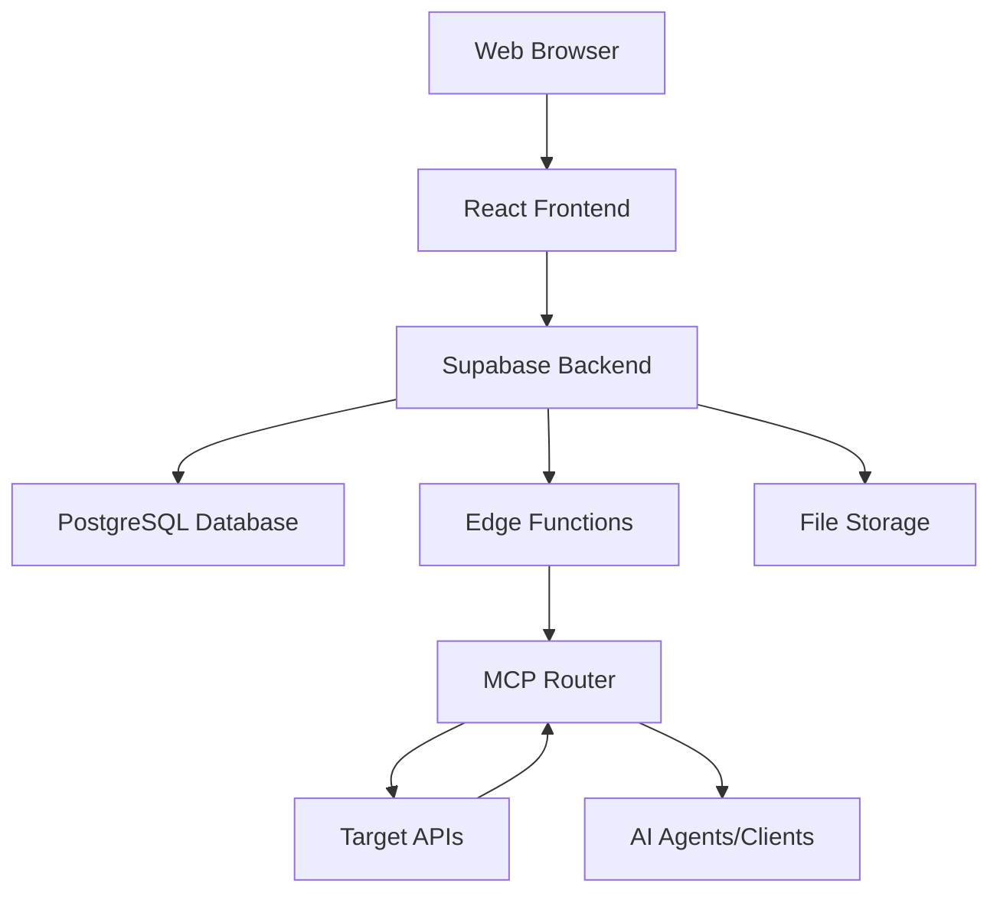
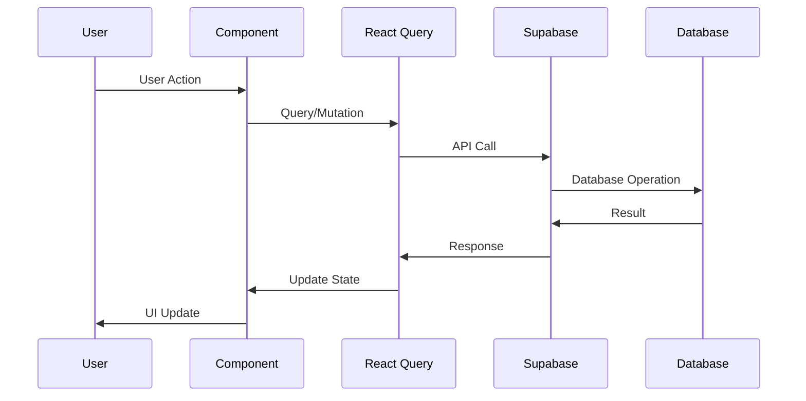
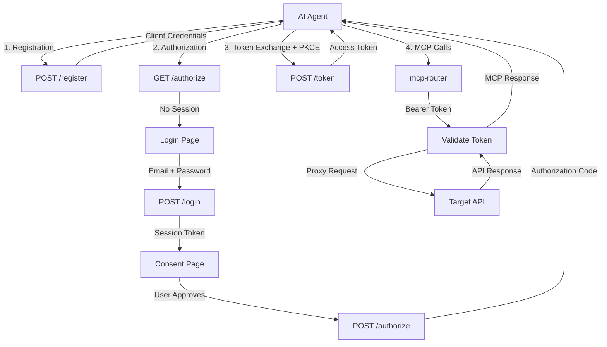
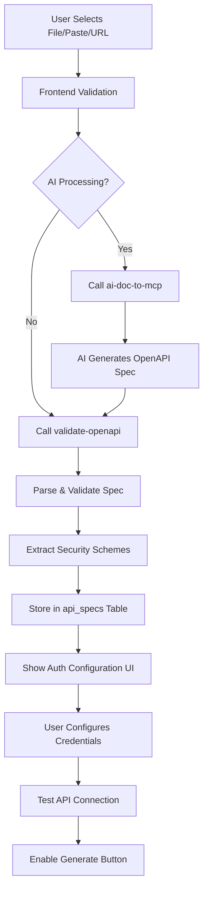
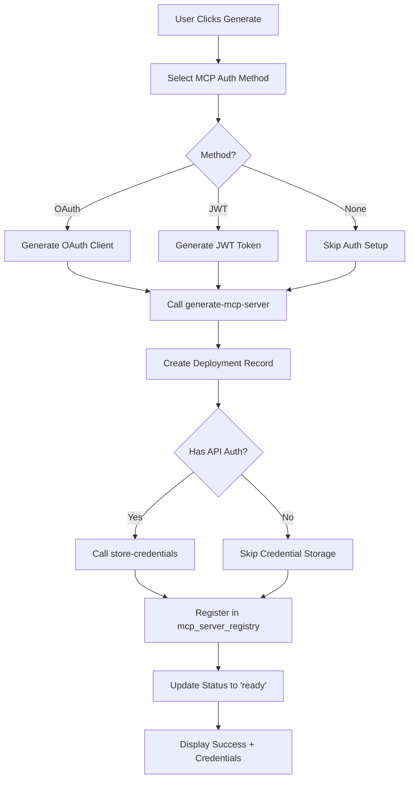
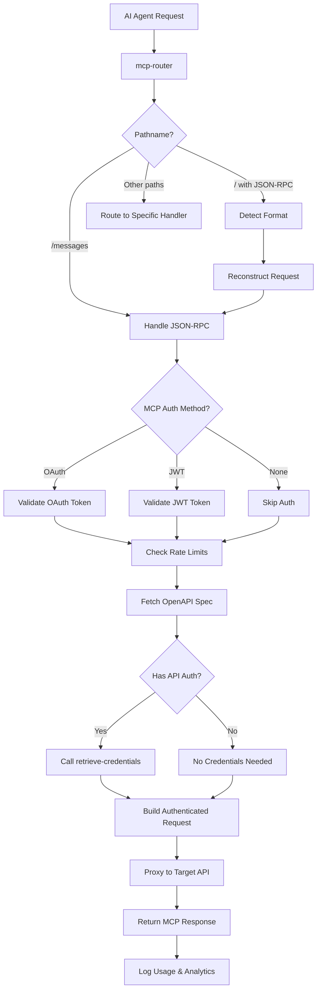
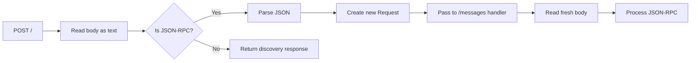
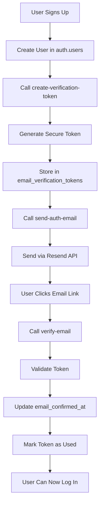
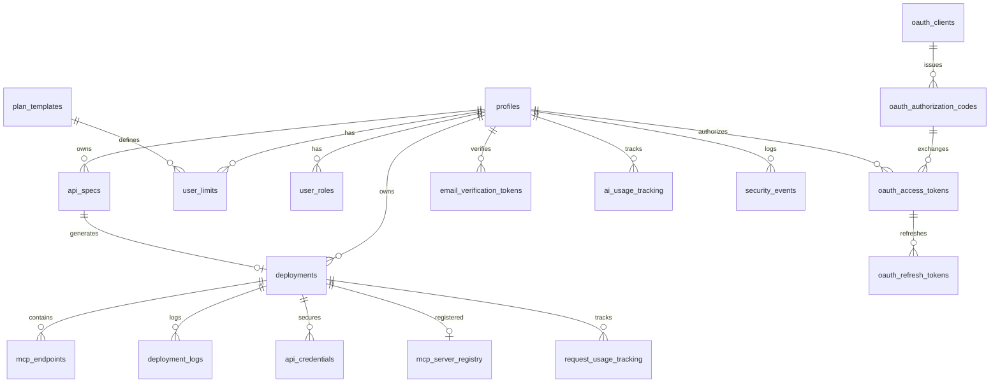
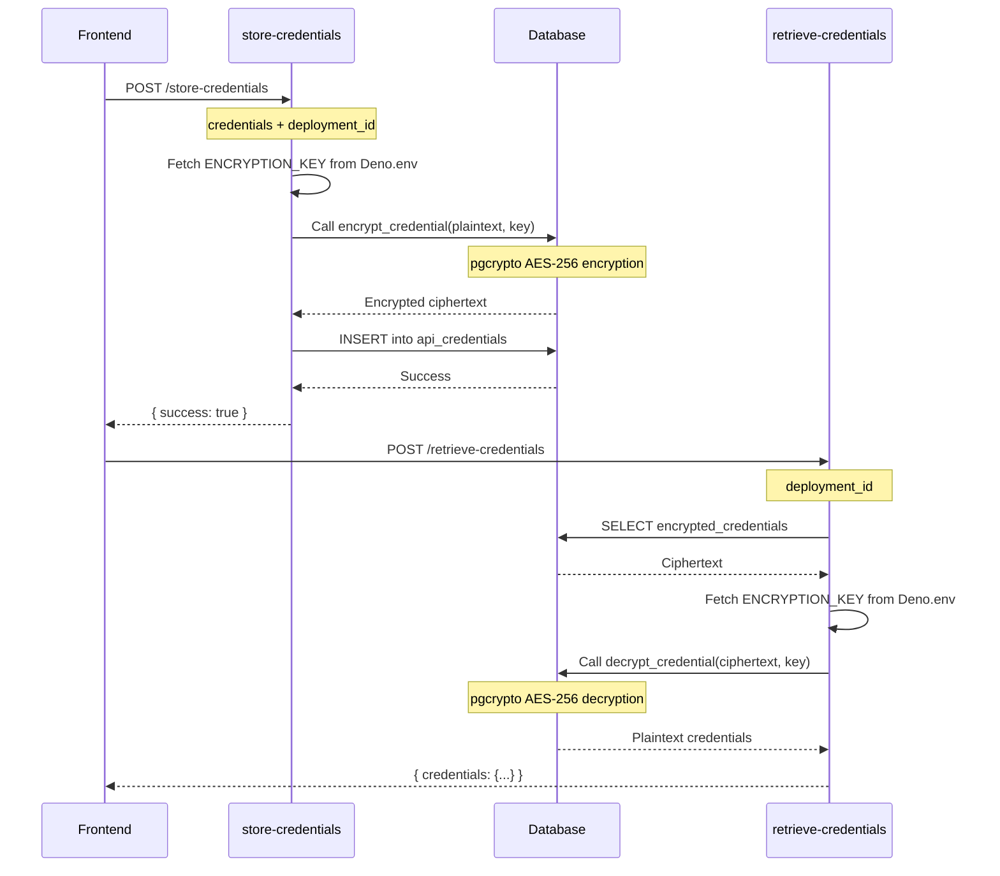

# Architecture Guide

Comprehensive technical architecture documentation for the Tydli platform.

## 🏛️ System Overview

The platform follows a modern full-stack architecture with clear separation between frontend, backend, and generated services.



## 🖥️ Frontend Architecture

### Component Hierarchy
```
App (ErrorBoundary)
├── AuthProvider
├── QueryClientProvider
├── Router
│   ├── LandingPage
│   ├── Auth
│   │   ├── Login/Signup Forms
│   │   └── Email Verification Handler
│   ├── Dashboard
│   │   ├── SmartDashboardHero
│   │   ├── DeploymentStatus
│   │   │   ├── Deployment Cards
│   │   │   ├── OAuthClientManager
│   │   │   └── DeploymentLogs
│   │   └── OnboardingTour
│   ├── Settings
│   ├── Billing
│   ├── Help
│   └── Contact
```

### State Management Strategy
- **React Query**: Server state, caching, automatic refetching
- **React Context**: Authentication (`useAuth`), analytics, feature flags
- **Local State**: Component-specific UI state
- **URL State**: Navigation, filters, search parameters

### Data Flow Patterns


## 🔧 Backend Architecture

### MCP Protocol Compliance (2025-03-26)

**All generated MCP servers are fully compliant with MCP Protocol Version 2025-03-26.**

#### Required Endpoints

Every deployed MCP server automatically includes:

1. **Metadata Discovery** (`/.well-known/mcp-server`)
   - Complete server metadata with protocol version
   - Capability declarations (tools: true, resources: false, prompts: false)
   - Authentication configuration
   - Endpoint URLs for all services

2. **Tools Endpoints**
   - `GET /tool` - List all available tools
   - `GET /tool/{name}` - Get specific tool metadata
   - `POST /tool/{name}` - Execute tool with arguments

3. **Resources Endpoint** (`GET /resources`)
   - Returns empty array (not applicable for API proxies)

4. **Prompts Endpoint** (`GET /prompts`)
   - Returns empty array (not applicable for API proxies)

5. **Health & Docs** (`/health`, `/docs`)
   - Health checks and human-readable documentation

#### Protocol Headers

All MCP responses include:
```
MCP-Protocol-Version: 2025-03-26
Content-Type: application/json
```

#### Authentication Integration

MCP servers support three authentication methods:
- **OAuth 2.1** - Bearer token validation against `oauth_access_tokens` table
- **JWT** - Static token comparison against `deployments.mcp_jwt_token`
- **None** - Public access with usage tracking against deployment owner

### Supabase Services Architecture
```
Supabase Platform
├── Authentication (Supabase Auth)
│   ├── Email/Password signup with verification
│   ├── JWT token management
│   └── Session handling
├── Database (PostgreSQL 15+ with RLS)
│   ├── Comprehensive RLS policies (see DATABASE_SCHEMA.md)
│   ├── Database functions for security and operations
│   └── pgcrypto extension for encryption
├── Storage (File Management)
│   └── api-specs bucket (private)
├── Edge Functions (Deno Runtime)
│   ├── See supabase/functions/ directory for complete list
│   └── JWT verification configurable per function
└── Real-time Subscriptions (for deployment status)
```

### Database Design Principles
- **Row Level Security**: User data isolation on all tables (see [Database Schema](./DATABASE_SCHEMA.md))
- **Normalized Schema**: Efficient relationships with proper foreign keys
- **JSONB Columns**: Flexible metadata storage for specs and configs
- **Audit Trails**: Comprehensive logging in `deployment_logs` and `security_events`
- **Performance Indexes**: User-scoped and timestamp indexes on all major tables

For complete database documentation including all tables, columns, RLS policies, and database functions, see [Database Schema Documentation](./DATABASE_SCHEMA.md).

### Edge Functions Architecture
```
Edge Function Runtime (Deno)
├── Authentication & Security
│   ├── send-auth-email (verify_jwt=false)
│   ├── verify-email (verify_jwt=false)
│   ├── create-verification-token (verify_jwt=false)
│   └── mcp-oauth-server (verify_jwt=false)
├── API Processing
│   ├── ai-doc-to-mcp (verify_jwt=true)
│   ├── validate-openapi (verify_jwt=true)
│   ├── rate-limited-validate-openapi (verify_jwt=true)
│   └── fetch-url (verify_jwt=true, if exists)
├── Deployment Management
│   ├── generate-mcp-server (verify_jwt=true)
│   ├── manage-deployment (verify_jwt=true)
│   └── fix-cors-headers (verify_jwt=true)
├── Credential Management
│   ├── store-credentials (verify_jwt=true)
│   └── retrieve-credentials (verify_jwt=true)
├── MCP Routing
│   └── mcp-router (verify_jwt=false, handles auth internally)
└── Analytics
    └── posthog-analytics (verify_jwt=true)
```

## 🔐 OAuth 2.1 Architecture

### OAuth Server Components



### OAuth Flow Security

**PKCE Implementation (S256 Required)**:
- Code verifier: 43-128 random characters
- Code challenge: Base64URL(SHA256(code_verifier))
- Challenge method: S256 only (plain not supported)
- State parameter: CSRF protection

**Session Management**:
- OAuth state stored in `oauth_pending_auth` table
- State tokens expire after 5 minutes
- One-time use (deleted after retrieval via `retrieve_oauth_state()`)
- Session-based login flow with hidden form fields

**Token Security**:
- Access tokens: 1-hour expiration
- Format: `mcp_access_{uuid}`
- Stored in `oauth_access_tokens` with user_id, expires_at, revoked fields
- Revocation support via UPDATE to set `revoked = true`
- Rate limiting per client_id

**Database Functions for OAuth**:
- `store_oauth_state()` - Securely stores OAuth parameters
- `retrieve_oauth_state()` - One-time retrieval of OAuth state
- `cleanup_expired_oauth_states()` - Removes expired state tokens
- `check_oauth_rate_limit()` - Enforces rate limits on OAuth endpoints
- `cleanup_expired_oauth_data()` - Maintenance cleanup of expired tokens

### Mobile-Responsive UI

All OAuth pages are fully responsive:

**Login Page** (`/login`):
- Email and password fields
- Clean mobile-first design
- Error messaging
- State token passed via hidden field

**Consent Page** (`/authorize` after login):
- Shows requesting application name
- Displays requested scopes
- User email confirmation
- "Approve" and "Deny" buttons
- Security warning message

**Breakpoints**:
- Mobile: 320px - 767px
- Tablet: 768px - 1023px
- Desktop: 1024px+

## 🛣️ Request Flow Architecture

### 1. File Upload Flow


### 2. MCP Server Generation Flow


### 3. MCP Request Routing Flow


### 3b. Base URL JSON-RPC Routing (Request Body Handling)

**Challenge**: HTTP Request bodies are streams that can only be read once. Reading a body and then passing the same request object causes "Body already consumed" errors.

**Solution**:


**Implementation Pattern:**
```typescript
// Read body once
const bodyText = await req.text();
const body = JSON.parse(bodyText);

// Detect JSON-RPC format
if (body.jsonrpc === "2.0" && body.method) {
  // Reconstruct request with fresh body stream
  const newReq = new Request(req.url, {
    method: req.method,
    headers: req.headers,
    body: bodyText  // Reuse the text we read
  });
  
  // Forward to /messages handler
  return await handleMCPRequest(newReq, ...args, "/messages", ...);
}
```

**Benefits:**
- ✅ No code duplication (reuses `/messages` logic)
- ✅ Avoids "Body already consumed" error
- ✅ Maintains backward compatibility
- ✅ Supports all JSON-RPC methods
- ✅ DRY principle compliance

### 4. Email Verification Flow

> **⚠️ IMPORTANT STATUS UPDATE**  
> **Date:** 2025-01-23  
> **Status:** Custom email system DISABLED  
> **Current System:** Supabase built-in email verification  
> **Details:** See [Email Authentication Configuration](../operations/EMAIL_AUTHENTICATION.md)

**The diagram and flow below represent the DISABLED custom system (kept for reference).**



**Current Active Flow (Supabase Built-in):**

1. User signs up → `supabase.auth.signUp()`
2. Supabase automatically sends verification email
3. User clicks link → Supabase verifies email
4. User redirected to `/auth` with hash fragments
5. Frontend detects verification, shows success
6. User logs in (or already logged in via session)

**Key Differences:**
- No custom edge functions involved
- Verification handled entirely by Supabase
- Hash fragments instead of query parameters
- Automatic session creation (configurable)

## 🔐 Security Architecture

### Three-Layer Authentication Model

**Layer 1: Email Verification**
- Required for all new accounts
- Tokens expire after 24 hours
- One-time use tokens
- Supabase auto-confirm disabled

**Layer 2: MCP Server Authentication**
- OAuth 2.1, JWT, or None
- Configured per deployment
- AI agents authenticate using selected method

**Layer 3: API Authentication**
- API Key, Bearer Token, OAuth2, or None
- Credentials encrypted with AES-256
- Server-side encryption/decryption only

### Authentication Flow Security
```
Security Layers
├── Email Verification (Account Security)
│   ├── create-verification-token function
│   ├── send-auth-email function
│   └── verify-email function
├── JWT Authentication (User Sessions)
│   ├── Supabase Auth JWT tokens
│   ├── RLS policies using auth.uid()
│   └── Edge function JWT verification
├── OAuth 2.1 (AI Agent Access)
│   ├── PKCE (S256 required)
│   ├── Session-based consent
│   └── Token validation in mcp-router
├── MCP Server Authentication (Layer 2)
│   ├── OAuth token validation
│   ├── JWT token validation
│   └── Public access mode
└── API Authentication (Layer 3)
    ├── Encrypted credential storage
    ├── Server-side decryption
    └── Dynamic credential injection
```

### Data Protection
- **Encryption at Rest**: Database encryption via Supabase
- **Encryption in Transit**: HTTPS/TLS for all connections
- **Credential Encryption**: AES-256 via pgcrypto with `ENCRYPTION_KEY`
- **Access Control**: RLS policies on all 18 tables
- **Audit Logging**: `security_events` and `deployment_logs` tables

### Security Boundaries
```
Trust Boundaries
├── User Session Boundary (Frontend ↔ Backend)
│   └── JWT tokens, secure cookies
├── Service Boundary (Edge Functions ↔ Database)  
│   └── Service role key, RLS policies
├── Tenant Boundary (User Data Isolation)
│   └── RLS policies with auth.uid()
├── Execution Boundary (MCP Router ↔ Target APIs)
│   └── Encrypted credentials, no code execution
└── Email Verification Boundary
    └── One-time tokens, service role access
```

## 📊 Data Architecture

### Database Schema Relationships


### Database Tables

The platform uses a comprehensive database schema with tables organized into functional categories:

**Core Application**: User profiles, API specs, deployments, endpoints, server registry, and logs

**Authentication & OAuth**: Email verification, OAuth clients, authorization codes, access tokens, refresh tokens, pending auth state, rate limits, and security events

**Credentials & Usage**: Encrypted API credentials, user limits, plan templates, user roles, request tracking, and AI usage

**For the complete table list with detailed column definitions, RLS policies, indexes, and relationships**, see [Database Schema Documentation](./DATABASE_SCHEMA.md).

### Data Flow Patterns
- **CQRS-like Separation**: Read/write operations optimized separately
- **Event-Driven Updates**: Real-time UI updates via Supabase realtime subscriptions
- **Background Processing**: Async tasks in edge functions using `EdgeRuntime.waitUntil()`
- **Audit Trail**: Immutable logs in `deployment_logs` and `security_events`

## 🚀 Deployment Architecture

### Infrastructure Components
```
Production Environment
├── Supabase Cloud Platform (nqfciqtsrcjorlqcglmq)
│   ├── PostgreSQL 15+ Database Cluster
│   ├── Edge Function Runtime (Global Deno)
│   ├── File Storage (api-specs bucket)
│   └── API Gateway (Load Balanced)
├── Resend Email Service
│   └── Transactional emails (verification, notifications)
├── PostHog Analytics
│   └── Event tracking and user analytics
└── CDN (Static Assets via Supabase)
```

### Scaling Strategies
- **Database**: Automatic scaling via Supabase, connection pooling
- **Edge Functions**: Auto-scale based on demand, serverless architecture
- **Storage**: Distributed file storage with RLS
- **Rate Limiting**: Database-enforced per-user quotas
- **Caching**: React Query on frontend, edge function response caching

## 🔄 Integration Architecture

### External Service Integrations
```
Integration Points
├── OpenAPI Specification Standards (3.0+, 3.1)
├── MCP Protocol 2025-03-26
├── AI Agent Compatibility
│   ├── Claude Desktop (OAuth + JWT)
│   ├── Continue.dev (JWT)
│   └── Custom MCP Clients (OAuth/JWT)
├── Email Service (Resend)
│   └── Authentication emails
├── Analytics (PostHog)
│   └── Event tracking
└── AI Processing (Google Gemini)
    └── Document-to-OpenAPI conversion
```

### API Design Patterns
- **RESTful APIs**: Standard HTTP verbs (GET, POST, PUT, DELETE)
- **JSON Communication**: All requests/responses use JSON
- **Error Standards**: Consistent error format with `error` and `message` fields
- **Rate Limiting**: HTTP 429 with `Retry-After` header
- **Authentication**: Bearer tokens in Authorization header

## 📈 Performance Architecture

### Optimization Strategies
```
Performance Layers
├── Frontend Optimization
│   ├── Code Splitting (React.lazy)
│   ├── Component Lazy Loading
│   ├── React Query Caching
│   └── Memo/Callback for expensive renders
├── Backend Optimization
│   ├── Database Indexing (user_id, timestamps)
│   ├── Connection Pooling (Supabase)
│   ├── Query Optimization (selective fields)
│   └── Background Task Processing
└── Infrastructure Optimization
    ├── Edge Computing (Global)
    ├── CDN Distribution
    └── Serverless Auto-scaling
```

### Monitoring & Observability
- **Application Metrics**: PostHog event tracking
- **Error Tracking**: Console logs with correlation IDs
- **User Analytics**: Signup, deployment, usage events
- **System Health**: Edge function logs via Supabase dashboard
- **Real-time Dashboards**: Deployment status updates

## 🔧 Development Architecture

### Code Organization
```
Project Structure
├── src/
│   ├── components/         (Reusable UI components)
│   ├── pages/              (Route-level components)
│   ├── hooks/              (Custom React hooks)
│   ├── integrations/       (Supabase client, types)
│   └── lib/                (Utilities, helpers)
├── supabase/
│   ├── functions/          (Edge functions)
│   ├── migrations/         (Database migrations)
│   └── config.toml         (Function configuration)
├── docs/                   (Documentation)
└── tests/                  (Test files and specs)
```

### Development Workflow
1. **Local Development**: Vite dev server with hot reload (port 8080)
2. **Type Safety**: TypeScript strict mode, auto-generated Supabase types
3. **Testing**: Manual testing, error boundaries for crash prevention
4. **Deployment**: Automatic via Supabase on code push
5. **Monitoring**: Real-time logs via Supabase dashboard

### Component Architecture Patterns
- **Atomic Design**: Small, focused, reusable components
- **Composition over Inheritance**: Component composition
- **Hooks-Based**: Functional components with custom hooks
- **Type Safety**: Props interfaces for all components
- **Error Boundaries**: Graceful error recovery

## 🔐 Credential Encryption Architecture

### Encryption Flow


### Security Benefits
- ✅ Encryption key never exposed to client
- ✅ Protection against XSS attacks (no client-side crypto)
- ✅ Database breach requires server access to decrypt
- ✅ Key rotation supported via `ENCRYPTION_KEY` update
- ✅ RLS policies ensure owner-only access

---

*This architecture supports scalable, secure, and maintainable platform growth. All components are production-ready and battle-tested.*

**Last Updated**: October 16, 2025
 
